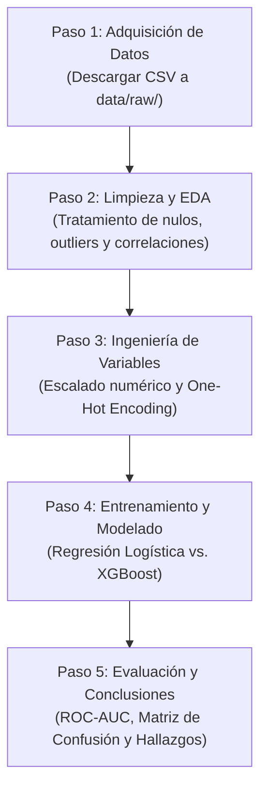

# Plan de Proyecto: Detección y Predicción de Abandono de Clientes (Customer Churn Analytics)

---

## 1. Contexto y Problema del Negocio

En el comercio electrónico, retener a un cliente existente es significativamente más económico que adquirir uno nuevo. Cuando un usuario decide dejar de comprar (evento conocido como ***churn*** o deserción), la empresa pierde tanto el ingreso inmediato como el valor de vida del cliente (*Lifetime Value* - LTV).

### Objetivo del Proyecto
Construir una solución de análisis de datos y modelado predictivo que permita:
1. **Identificar patrones clave de comportamiento:** Analizar qué variables (inactividad, quejas de soporte, frecuencia de compra, descuentos) influyen más en la decisión del cliente de abandonar la plataforma.
2. **Predecir la probabilidad individual de fuga:** Entrenar modelos de clasificación para alertar tempranamente sobre qué clientes tienen alto riesgo de abandono.
3. **Traducir los hallazgos en acciones de retención:** Generar recomendaciones visuales y claras para que las áreas de marketing y operaciones puedan intervenir antes de que el cliente se vaya.

---

## 2. Fuentes de Datos: ¿De dónde sacamos los datos?

Para no complicar la descarga con bases de datos pesadas ni configuraciones complejas, se proponen dos alternativas reales de libre acceso en **Kaggle**:

### Opción 1 (Recomendada para iniciar rápido y directo)
* **Dataset:** [E-Commerce Customer Churn Analysis and Prediction (Kaggle)](https://www.kaggle.com/datasets/ankitverma2010/ecommerce-customer-churn-analysis-and-prediction)
* **¿Por qué esta opción?:**
  * Ya viene con la variable objetivo etiquetada (`Churn`: 1 si desertó, 0 si sigue activo).
  * Tiene el tamaño ideal (~5.600 a 10.000 filas): lo suficientemente grande para hacer estadística real y machine learning, pero lo suficientemente ligero para manipularlo al instante en Pandas sin problemas de memoria.
  * Contiene exactamente las variables que se relacionan con el negocio:
    * `CustomerID`: ID del usuario.
    * `Tenure`: Tiempo de permanencia en meses.
    * `DaySinceLastOrder`: Días desde la última compra (Recencia).
    * `OrderCount`: Total de compras realizadas (Frecuencia).
    * `CashbackAmount`: Monto devuelto / gastado (Monetario).
    * `Complain`: Reclamos o quejas abiertas (1 = Sí, 0 = No).
    * `SatisfactionScore`: Calificación de satisfacción (1 al 5).
    * `PreferredPaymentMode`, `PreferredLoginDevice`, `CityTier`, etc.

### Opción 2 (Alternativa si el profesor exige "Big Data" / Gran Escala)
* **Dataset:** [Brazilian E-Commerce Public Dataset by Olist (Kaggle)](https://www.kaggle.com/datasets/olistbr/brazilian-ecommerce)
* **¿Por qué esta opción?:**
  * Son más de 100.000 órdenes reales entre 2016 y 2018 divididas en varias tablas (`orders.csv`, `order_items.csv`, `reviews.csv`, `customers.csv`).
  * Muestra habilidad para cruzar tablas relacionales (*merges/joins*) y calcular la variable de abandono manualmente (ejemplo: si un usuario no compra hace más de 90 días = Churn).
  * Si se usa esta opción, aquí sí podemos usar **Polars** o **PyArrow** para procesar los 100k registros a toda velocidad.

> **Recomendación inicial:** Empezar con la **Opción 1** para tener el flujo completo funcional de principio a fin (limpieza, análisis y modelos), y si la materia requiere demostrar manejo de volumen relacional, escalar a la **Opción 2**.

---

## 3. Stack Tecnológico (Librerías Justas y Necesarias)

Mantendremos el entorno ligero, conocido y sin herramientas pesadas innecesarias:

| Librería | ¿Para qué sirve en este proyecto? | ¿Es obligatoria? |
| :--- | :--- | :--- |
| **`pandas`** | Carga, filtrado, agrupaciones y manipulación de tablas de datos. | Sí |
| **`numpy`** | Operaciones numéricas, matrices y transformaciones matemáticas. | Sí |
| **`matplotlib`** | Gráficos base (histogramas, dispersión, barras). | Sí |
| **`seaborn`** | Gráficos estadísticos atractivos (mapa de correlación, curvas de distribución). | Sí |
| **`scikit-learn`** | Preprocesamiento (escalado, división train/test) y modelos (Regresión Logística, Árboles, métricas). | Sí |
| **`xgboost`** | Modelo avanzado de Gradient Boosting para comparar si supera a la Regresión Logística. | Sí (opcional pero recomendado) |
| **`polars` / `pyarrow`** | Procesamiento rápido si el archivo llega a ser muy pesado (solo si usamos Olist). | Opcional (solo si se requiere) |
| **`jupyter` / `ipykernel`** | Entorno para documentar paso a paso la exploración y pruebas. | Sí |

### ¿Qué quitamos respecto a versiones sobrecargadas y por qué?
* **Sin PySpark:** PySpark requiere instalar Java, configurar clústeres y gasta mucha memoria local. Para datasets menores a 5-10 GB, Pandas o Polars son hasta 10 veces más rápidos y fáciles de depurar.
* **Sin FastAPI ni Docker:** No necesitamos levantar servidores web ni crear microservicios si el objetivo del curso es el análisis y el modelado predictivo.
* **Sin SHAP / LightGBM complejos:** Con la matriz de correlación, los coeficientes de la Regresión Logística y la importancia de variables (`feature_importances_`) de Scikit-Learn/XGBoost, se explican perfectamente los resultados a nivel gerencial.

---

## 4. Estructura Limpia del Proyecto

Una estructura ordenada que separa datos, análisis exploratorio y código reutilizable:

```text
adge_proyecto/
├── data/
│   ├── raw/                 # Archivo original descargado de Kaggle (inmutable)
│   └── processed/           # Dataset limpio y listo para modelar (en CSV o Parquet)
├── notebooks/
│   ├── 01_eda_limpieza.ipynb           # Carga, calidad de datos, nulos y gráficos exploratorios
│   └── 02_modelado_predictivo.ipynb    # Entrenamiento, comparación de modelos y métricas
├── docs/
│   ├── Informe.md               # Trabajo escrito formal para entrega
│   ├── Plan.md                  # Este plan de trabajo y arquitectura
│   └── Rubrica.md               # Lineamientos del docente
├── requirements.txt         # Lista limpia de las librerías principales
└── README.md                # Presentación general del proyecto y cómo correrlo
```

---

## 5. Hoja de Ruta Paso a Paso (Roadmap de Ejecución)



### Paso 1: Adquisición y Carga de Datos
* Descargar el dataset seleccionado y ubicarlo en `data/raw/`.
* Crear una función simple en Python o primera celda en el Notebook para leer el archivo con Pandas.
* Validar dimensiones (filas y columnas), tipos de datos y balance inicial de la variable `Churn` (¿cuántos abandonaron vs. cuántos se quedaron?).

### Paso 2: Limpieza y Análisis Exploratorio de Datos (EDA)
* **Tratamiento de nulos:** Imputar valores faltantes (por ejemplo, mediana para días de última compra o moda para categorías).
* **Análisis de distribución (Univariado):**
  * Histograma de antigüedad (`Tenure`) y días desde la última compra.
  * Frecuencia de quejas (`Complain`).
* **Análisis Bivariado (Relación con el Churn):**
  * ¿Los clientes que se quejan tienen una tasa de abandono mayor?
  * ¿Cómo impacta el puntaje de satisfacción en la deserción?
  * Mapa de calor (*Heatmap*) de correlaciones entre variables numéricas.

### Paso 3: Preparación de Datos para Machine Learning
* Separar variables predictoras ($X$) y variable objetivo ($y = \text{Churn}$).
* Codificación de texto a números (*One-Hot Encoding* o *get_dummies* para tipo de pago, dispositivo, etc.).
* Escalado de variables continuas (`StandardScaler` o `MinMaxScaler` de Scikit-Learn).
* División de datos: 80% para entrenar (`X_train`, `y_train`) y 20% para evaluar (`X_test`, `y_test`), manteniendo la proporción de clases (`stratify=y`).

### Paso 4: Modelado Matemático y Algoritmos
Implementar dos enfoques para comparar rendimiento:
1. **Modelo Base - Regresión Logística (`LogisticRegression`):**
   * Es el modelo canónico en estadística para clasificación binaria.
   * Utiliza la función sigmoide:
     $$P(Y=1 \mid X) = \frac{1}{1 + e^{-(\beta_0 + \beta_1 X_1 + \dots + \beta_k X_k)}}$$
   * Permite interpretar directamente qué variables aumentan o disminuyen el riesgo según el signo de sus coeficientes ($\beta$).
2. **Modelo Avanzado - Random Forest o XGBoost (`XGBClassifier`):**
   * Captura relaciones no lineales y combinaciones de factores (ej. usuario nuevo + queja sin resolver = fuga inminente).

### Paso 5: Evaluación, Métricas y Conclusiones
* **Matriz de Confusión:** Cuántos desertores logramos detectar correctamente (Verdaderos Positivos) y cuántos se nos escaparon (Falsos Negativos).
* **Métricas Clave:**
  * **Recall (Sensibilidad):** Métrica principal en churn, porque dejar ir a un cliente que se iba a fugar cuesta más que mandar una promoción a alguien que se iba a quedar.
  * **ROC-AUC:** Capacidad general del modelo para distinguir clientes fieles de clientes en riesgo.
  * **F1-Score:** Balance entre precisión y sensibilidad.
* **Top Factores de Deserción:** Gráfico de barras con las variables más determinantes.
* **Conclusiones Prácticas:** 3 a 4 recomendaciones claras para el negocio (ej. "Los clientes con quejas en sus primeros 6 meses tienen 3x más probabilidad de abandono; se recomienda protocolo de atención prioritaria").
